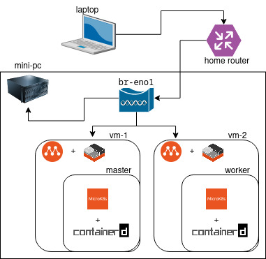

## Kubernetes for Developers (LFD259) Study Notes to prepare for the CKAD Certification Exam

To run Kubernetes locally as a single-node on your laptop you have more than one option, e.g. see:
- [Small Kubernetes for your local experiments](https://blog.flant.com/small-local-kubernetes-comparison/)
- [Setting up a Kubernetes cluster](https://www.armosec.io/blog/setting-up-kubernetes-cluster/)

If you have a spare/old laptop or a server/mini-pc, you can setup a mini cluster consisting of two nodes (master + worker) launching `multipass` instances (using `LXD` as backend) which run `MicroK8s` (using `containerd` as container runtime). See the following image for the network topology of such configuration:

<p align="center">
    
</p>

The [setup.sh](setup.sh) script roughly scketches how to bootstrap the minicluster.

Additional resources you will need to setup your cluster to simulate the official course environment:
- a SSH-tunnel to reach from your laptop the service exposed from the cluster passing through the host system: `ssh -L local-port:multipass-master-ip:web-service-port -N -f username@ssh-server-ip`
- a userland implementation of NFSv3 like `unfsd` (see [CreateUNFS.sh](CreateUNFS.sh)): but it can be tricky, since you are not allowed two turn multipass instances into LXD privileged containers
  - alternatively, consider to just mount a directory from the host as follows: `multipass mount -u $UID:1000 ckad/ master:/mnt`
- linkerd version `stable-2.10.0` (more recent versions will not work with latest ingress-nginx version you will be required to install)

Tips for the exams:
- read the [candidate handbook](https://docs.linuxfoundation.org/tc-docs/certification/lf-candidate-handbook) and the [instructions](https://docs.linuxfoundation.org/tc-docs/certification/tips-cka-and-ckad) of the exam
- make sure you have bookmarked the pages of the official Kubernetes docs where you can quickly find example of valid manifests to create objects/resources
  - if you have not yet collected this stuff, see [here](https://github.com/reetasingh/CKAD-Bookmarks)
- set autocompletion for `kubectl` commands:
  ```
  $ alias k='kubectl'
  $ source <(kubectl completion bash)
  $ echo "source <(kubectl completion bash)" >> ~/.bashrc
  $ complete -F __start_kubectl k
  ```
- get familiar with vi/vim, if you dont't use them frequently
- get used to pasting text using the mouse middle/center key, as customary in most of Linux distross
