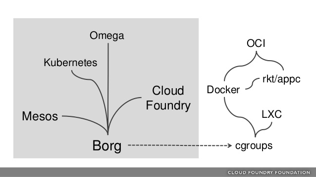

## 1. Introduction
---

**Kubernetes**, also known as **K8s**, is an open-source system (written in Go language) for automating deployment, scaling, and management of containerized applications.

Deploying and connecting containers across multiple hosts, scaling them, deploying applications without downtime, and service discovery among several aspects can be complex.

Kubernetes addresses those challenges from the start with a set of primitives and a powerful open and extensible API. The ability to add new objects and operators allows easy customization for various production needs. The ability to add multiple schedulers and multiple API servers adds to this customization.

Kubernetes can be an integral part of Continuous Integration/Continuous Delivery (CI/CD), as it offers many of the necessary components.

Instead of using a large server, Kubernetes approaches the issue of facing web traffic increases by deploying a large number of small web servers, or microservices. The server and client sides of the application expect that there are one or more microservices, called **replicas**, available to respond to a request.

Communication to, as well as internally, between components, is API call-driven, which allows for flexibility. Configuration information is stored in a JSON format, but is most often written in YAML. Kubernetes agents convert the YAML to JSON prior to persistence to the database.

The developer experience has been boosted tremendously thanks to containers. However, managing containers at scale and architecting a distributed application based on microservices' principles is still challenging.

> Tip: You can test your microservices' resiliency with [Chaos Monkey](https://netflix.github.io/chaosmonkey/)

Kubernetes is inspired by **Borg** - the internal system used by Google to manage its applications (e.g. Gmail, Apps, GCE). Borg has inspired current data center systems, as well as the underlying technologies used in container runtime today. Google contributed **cgroups** to the Linux kernel in 2007; it limits the resources used by collection of processes. Both cgroups and Linux namespaces are at the heart of containers today, including Docker. Also Apache Mesos and Cloud Foundry projects can be traced back to Borg.

    

In its simplest form, Kubernetes is made of one or more central **managers** (aka masters) and **worker nodes**. The manager runs an API server, a scheduler, various operators and a datastore to keep the state of the cluster, container settings, and the networking configuration.

Kubernetes exposes an API via the API server: you can communicate with the API using a local client called **kubectl** or you can write your own client. The **kube-scheduler** sees the API requests for running a new container and finds a suitable node to run that container. Each node in the cluster runs two containers: **kubelet** and **kube-proxy**. The kubelet container receives spec information for container configuration, downloads and manages any necessary resources and works with the container engine on the local node to ensure the container runs or is restarted upon failure. The kube-proxy container creates and manages local firewall rules and networking configuration to expose containers on the network.

    

