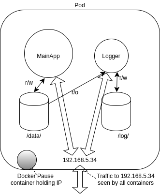

## Networking

A Pod represents a group of co-located containers with some associated data volumes. All containers in a Pod share the same network namespace.

The diagram below shows a pod with two containers, MainApp and Logger, and two data volumes, made available under two mount points. Containers MainApp and Logger share the network namespace of a third container, known as the pause container. The pause container is used to get an IP address, then all the containers in the pod will use its network namespace. You won’t see this container from the Kubernetes perspective, but you would by running `sudo docker ps`.

    

A container orchestration system must address three networking issues:

- coupled container-to-container communication (solved by the Pod concept)
- pod-to-pod communication
- external-to-pod communication

The Service object is used to connect Pods within the same network using `ClusterIP` adresses, from outside of the cluster using `NodePort` addresses, and using a load balancer if configured with a `LoadBalancer` service.

An Ingress Controller or a service mesh like Istio can also be used to connect traffic to a Pod.

o provide container networking, Kubernetes is standardizing on the Container Network Interface ([CNI](https://github.com/containernetworking/cni)) specification. As of v1.6.0, `kubeadm` (the Kubernetes cluster bootstrapping tool) uses CNI as the default network interface mechanism.

While a CNI plugin can be used to configure the network of a pod and provide a single IP per pod, CNI does not help you with pod-to-pod communication across nodes.

The early requirement from Kubernetes was the following:

- All pods can communicate with each other across nodes.
- All nodes can communicate with all pods.
- No Network Address Translation (NAT).

Basically, all IPs involved (nodes and pods) are routable without NAT. This can be achieved at the physical network infrastructure if you have access to it (e.g. GKE). Or, this can be achieved with a software defined overlay with solutions like:

- Weave
- Flannel
- Calico
- Cilium.

Most network plugins now support the use of Network Policies, which act as an internal firewall, limiting ingress and egress traffic.

---

- 1. [Illustrated Guide to Kubernetes Networking](https://speakerdeck.com/thockin/illustrated-guide-to-kubernetes-networking)
