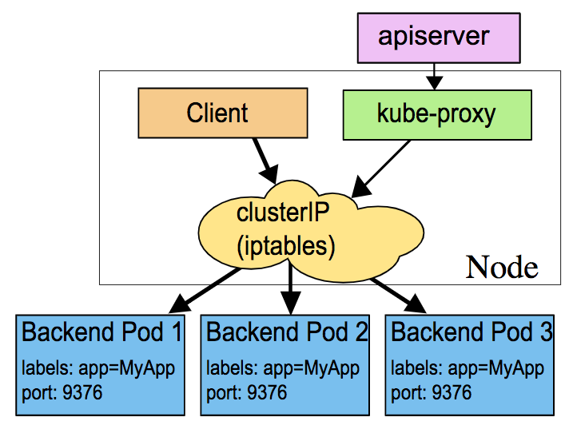

## Service

Types:

- ClusterIP (default), only provides access internally (except if manually creating an external endpoint)
- NodePort, great for debugging, or when a static IP address is necessary, such as opening a particular address through a firewall
- LoadBalancer, created to pass requests to a cloud provider like GKE or AWS (even without a cloud provider, the address is made available to public traffic, and packets are spread among the Pods in the deployment automatically)
- ExternalName, allows the return of an alias to an external service, can be useful for services not yet brought into the Kubernetes cluster (a simple change of the type in the future would redirect traffic to the internal objects)

> Note: As **CoreDNS** has become more stable, the ExternalName service is not used as much.

The kube-proxy running on cluster nodes watches the API server service resources. It presents a type of virtual IP address for services other than ExternalName. The mode for this process has changed over versions of Kubernetes.

In v1.0, services ran in userspace mode as TCP/UDP over IP or Layer 4.
In the v1.1 release, the iptables proxy was added and became the default mode starting with v1.2.

In the iptables proxy mode, kube-proxy continues to monitor the API server for changes in Service and Endpoint objects, and updates rules for each object when created or removed. One limitation to the new mode is an inability to connect to a Pod should the original request fail, so it uses a Readiness Probe to ensure all containers are functional prior to connection. This mode allows for up to approximately 5000 nodes. Assuming multiple Services and Pods per node, this leads to a bottleneck in the kernel.

Another mode beginning in v1.9 is ipvs. While in beta, and expected to change, it works in the kernel space for greater speed, and allows for a configurable load-balancing algorithm. This can be helpful for large clusters, much past the previous 5000 node limitation.

    

Labels are used to determine which Pods should receive traffic from a service. Labels can be dynamically updated for an object, which may affect which Pods continue to connect to a service.

The default update pattern is for a **rolling deployment**, where new Pods are added, with different versions of an application, and due to automatic load balancing, receive traffic along with previous versions of the application.

Should there be a difference in applications deployed, such that clients would have issues communicating with different versions, you may consider a more specific label for the deployment, which includes a version number. When the deployment creates a new replication controller for the update, the label would not match. Once the new Pods have been created, and perhaps allowed to fully initialize, we would edit the labels for which the Service connects. Traffic would shift to the new and ready version, minimizing client version confusion.
